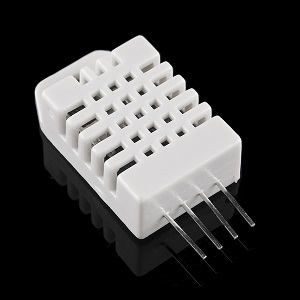
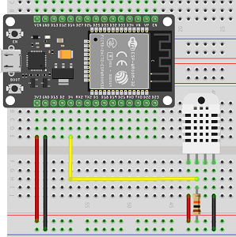

# Librairie pour le DHT22

Le but de cette librairie est de contrôler un DHT22, un capteur de température/humidité à bas prix.

Celle-ci ajoute quelques fonctionnaltés à la librairie fournie par adafruit [DHT-sensor-library](https://github.com/adafruit/DHT-sensor-library) qui elle même utilise [Adafruit_Sensor](https://github.com/adafruit/Adafruit_Sensor).

## Le DHT22
### Petit rappel

  

Le DHT22 (également nommé AM2302) est un capteur de température et d'humidité.

Ces caractéristiques sont les suivantes :

|||
|---|---|
|**Alimentation**|3.3 à 6V|
|**Consommation**|2.5mA|
|**Echantillonage**|0.5Hz (soit 2 secondes)|
|**Plage d'utilisation température**|-40 à 80°C|
|**Précision capteur température**|inférieur à ±0.5°C|
|**Plage d'utilisation humidité**|0 à 100%|
|**Précision capteur humidité**|±2% (maximum ±5%)|
|**Taille**|15.1 par 25.1 par 7.7mm|

Les broches de gauche à droites sont les suivantes :

|Broche|Fonction|
|---|---|
|**1**|Alimentation|
|**2**|Communication|
|**3**|non utilisée (non connectée)|
|**4**|masse|

### Le Cablâge

  

## La librairie
### Les fonctionnalités

Les fonctionnalités ajoutés sont les suivantes :
- possibilité de changer de type de température (Celcius, Fahrenheit);
- possibilité d'appliquer une correction sur les valeurs remontées par le capteur.